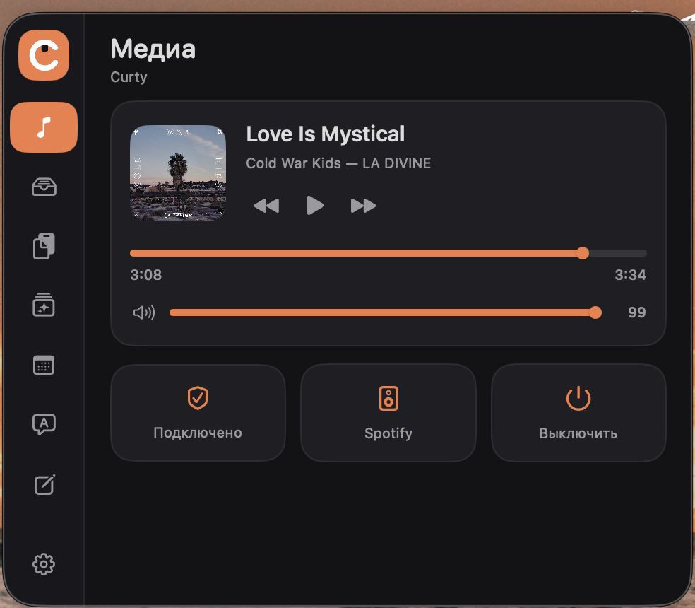
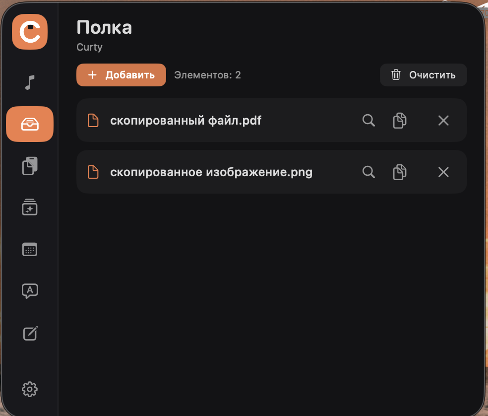
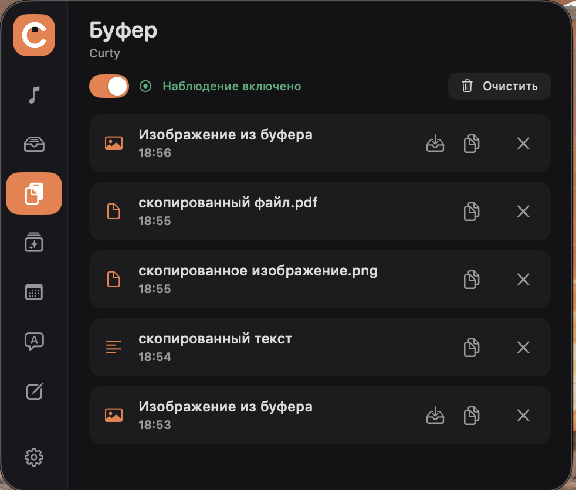
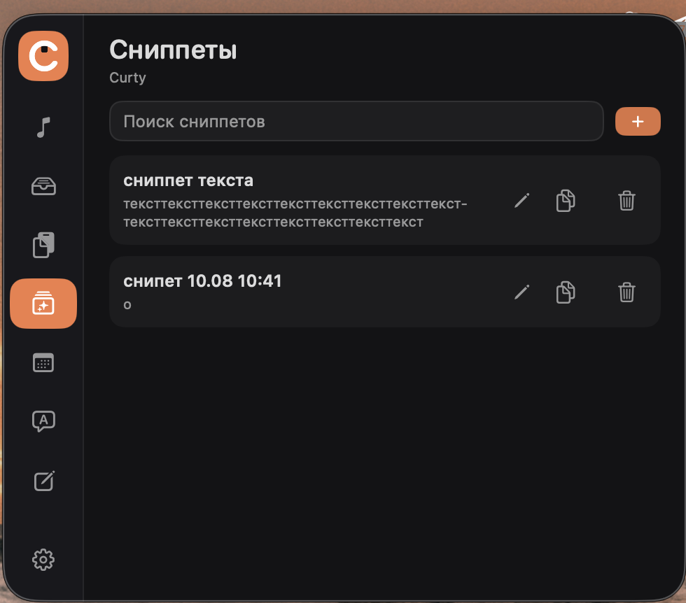
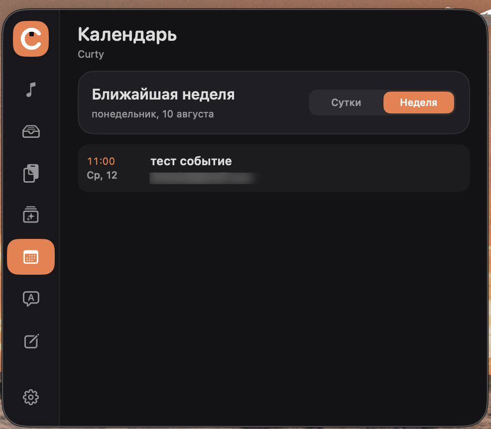
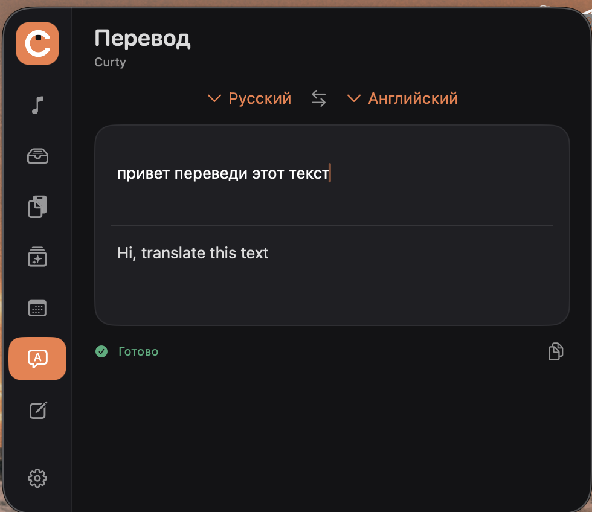
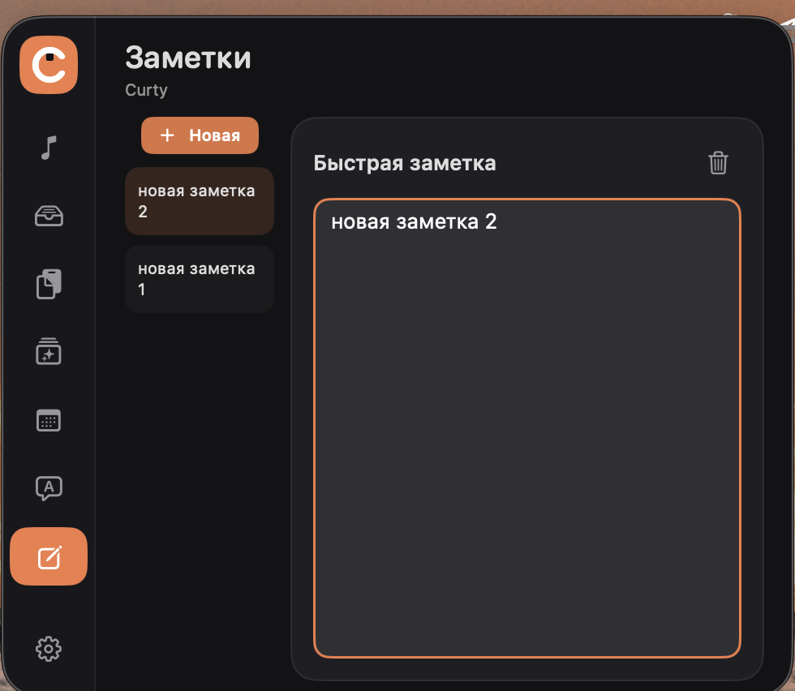

# Curty

Curty — утилита для строки меню macOS, которая живёт в вырезе экрана. Наводите курсор на вырез — сверху раскрывается панель с семью инструментами. Увели курсор — она исчезает.

Вырез экрана не обязателен: на маках без него панель открывается с верхнего края или из строки меню.

Всё работает на самом компьютере. Наружу уходят ровно два запроса, оба описаны ниже.

| | |
|---|---|
| **Медиа**<br> | **Полка**<br> |
| **Буфер**<br> | **Сниппеты**<br> |
| **Календарь**<br> | **Перевод**<br> |
| **Заметки**<br> | |

## Что внутри

**Медиа** — что играет в Spotify или Music: обложка, перемотка, громкость плеера. Управляется прямо из шторки, переключаться в приложение не нужно.

**Полка** — файлы, которые нужны под рукой. Перетащите их на вырез или добавьте кнопкой. Копирование кладёт в буфер сам файл, а не путь к нему, пробел показывает быстрый просмотр, ⌘C копирует выделенное. Полка помнит ссылки, а не копии: файлы остаются на своих местах.

**Буфер** — история скопированного: текст, файлы, изображения. Любую запись можно вернуть в буфер, картинку — сохранить на полку. История живёт только в памяти и исчезает при выходе.

**Сниппеты** — текст, который приходится набирать снова и снова: реквизиты, шаблоны ответов, куски кода.

**Календарь** — ближайшие встречи на сутки или неделю. У встречи со ссылкой на созвон появляется кнопка «Войти»: Curty открывает только известные ей сервисы и только по https.

**Перевод** — 38 языков, работает без интернета. Язык определяется по тексту, перевод появляется сам, пока вы печатаете.

**Заметки** — быстрые записи, которые не хочется заводить в отдельном приложении.

## Установка

Нужен macOS 15 или новее и компилятор Swift:

```bash
xcode-select --install
```

Несмотря на название, эта команда ставит **не Xcode**, а Command Line Tools — компилятор, линкер и SDK, около полутора гигабайт. Само приложение Xcode на пятнадцать гигабайт для сборки Curty не нужно.

Затем:

```bash
git clone https://github.com/AYSGODX/Curty.git
cd Curty
Scripts/install.sh
```

Скрипт соберёт приложение, положит его в «Программы» и запустит. В строке меню появится иконка щита.

## Как открыть панель

**На маке с вырезом** — навести курсор на сам вырез, панель раскроется под ним.

**На маке без выреза** вырез заменяет узкая полоса по центру верхнего края экрана: курсор нужно довести до самого верха, будто упереться в край. Полоса намеренно тонкая — иначе панель раскрывалась бы каждый раз, когда мышь идёт к строке меню.

**Всегда работает** щелчок по иконке щита в строке меню → «Открыть Curty». Открытая так панель закрывается щелчком мимо неё, а если курсор к ней так и не подошёл — гаснет сама через несколько секунд. Escape закрывает её после того, как вы щёлкнули внутрь: до этого нажатия клавиш до панели не доходят.

Панель появляется по центру верхнего края того экрана, где сейчас курсор, — на внешнем мониторе тоже.

При первом открытии вкладки «Медиа» macOS спросит разрешение на управление Spotify или Music.

Приложение, собранное на своей машине, не имеет карантинного атрибута, поэтому Gatekeeper его не блокирует и обходить ничего не нужно.

## Обновление

Кнопка «Обновить» в настройках Curty. Она загорается, только когда на GitHub есть коммит новее установленной сборки, и открывает [`Scripts/update.command`](Scripts/update.command) в Терминале: тот забирает свежую версию, пересобирает её и переустанавливает приложение. Двойной клик по этому же файлу в Finder делает ровно то же самое.

Сама Curty ничего не устанавливает и не может: она в песочнице, писать за пределы своего контейнера ей нечем, а новая версия ещё и собирается из исходников. То же самое руками:

```bash
git pull && Scripts/install.sh
```

Данные не теряются: заметки, сниппеты, полка и настройки лежат в контейнере приложения и привязаны к его идентификатору, а не к файлу приложения.

## Разрешения и почему они слетают

Требование подписи у обычной локальной сборки — `cdhash`, то есть хеш содержимого. Он меняется при каждой пересборке, поэтому macOS видит новое приложение и сбрасывает всё, что вы ему разрешили: доступ к календарю, управление Spotify и Music. Чем чаще обновляетесь, тем заметнее.

Лечится собственным сертификатом. Требование подписи становится «тот же идентификатор, тот же сертификат», и разрешения переживают обновление. Создаётся один раз:

```bash
Scripts/create-signing-certificate.sh
Scripts/install.sh
```

Первая команда создаёт сертификат и просит пароль — система добавляет его в доверенные, иначе подпись не считается действительной. Вторая пересобирает приложение уже с ним.

То же самое руками, если скрипт почему-то не отработал: «Связка ключей» (лежит в `/System/Library/CoreServices/Applications/`, а не в «Утилитах») → меню «Ассистент сертификации» → «Создать сертификат», имя **`Curty Self-Signed`**, тип идентификации «Самоподписанный корневой», тип сертификата **«Подписывание кода»**.

Сборка сама подхватит сертификат по имени и скажет об этом строкой «Подписано локальным сертификатом». Имя можно поменять переменной `STABLE_IDENTITY_NAME`. Если сертификата нет, всё работает как раньше — просто разрешения придётся выдавать после каждого обновления.

Это не подпись Developer ID: раздавать такую сборку готовым бинарником по-прежнему нельзя, см. «Передачу другим людям».

## Календари Google и других сервисов

Отдельного входа в Google из Curty нет и не нужно: события читаются из системного «Календаря», а он умеет Google, Exchange и остальные учётные записи сам. Добавьте аккаунт в «Системные настройки» → «Учётные записи интернета», включите в нём «Календари» — и события появятся в Curty, без токенов, паролей и лишних сетевых запросов с её стороны.

Curty читает все календари сразу и никак их не фильтрует. Под названием встречи она показывает, из какого календаря событие взято.

## Приватность и безопасность

Curty работает в песочнице macOS: прочитать файл, который вы не выбрали сами, он не может — это ограничение системы, а не обещание приложения. История буфера и события календаря живут только в памяти: они не пишутся на диск и исчезают при выходе из Curty — но не при засыпании и блокировке экрана, так что на общей машине историю стоит чистить кнопкой «Очистить». Заметки, сниппеты и ссылки полки лежат в контейнере приложения с правами `0600`.

Наружу уходят ровно два запроса. Первый — загрузка обложки играющего трека по ссылке, которую сообщает сам плеер. Второй — вопрос к `api.github.com` о том, какой коммит сейчас в ветке `main`; он не несёт о вас никаких данных и делается не чаще раза в полчаса, когда открыта вкладка настроек. Телеметрии и аналитики нет, само по себе приложение не обновляется — установку всегда запускает человек.

Границы держит не это описание, а [`Scripts/security-check.sh`](Scripts/security-check.sh). Он валит сборку, если сетевой код появится где-нибудь кроме `ArtworkLoader.swift` и `UpdateChecker.swift`, если у загрузчика обложек пропадёт список разрешённых хостов или проверка обновлений перестанет ходить строго на `api.github.com`, или если в проекте всплывут приватные фреймворки, `dlopen` или синтез событий ввода. Скрипт запускается на каждой сборке, поэтому смотреть действующие правила стоит прямо в нём: он не может разойтись с кодом, а текст — может.


## Передача другим людям

Код распространяется под лицензией MIT, см. [LICENSE](LICENSE).

